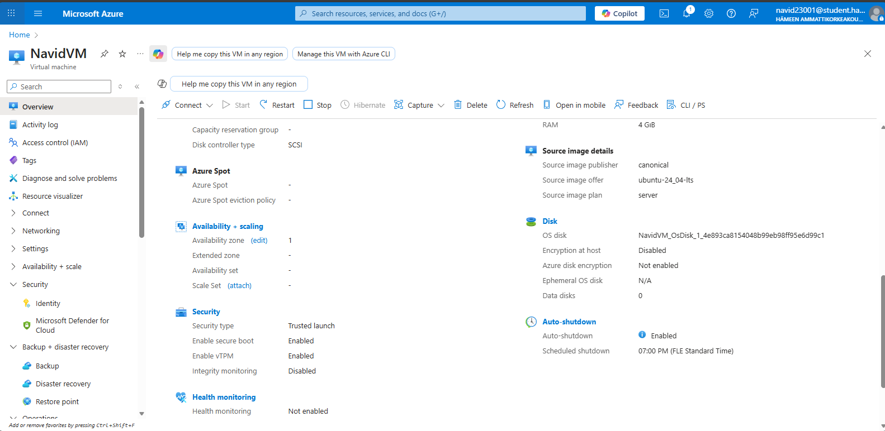
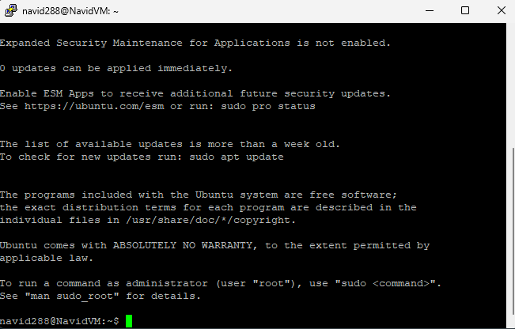

# -Linux-assignments
# Azure Linux Virtual Machine Setup 

This repository documents the creation of an Ubuntu Server 24.04 LTS Linux virtual machine in Microsoft Azure using a HAMK student account and the successful SSH connection to the VM shell. The VM will be used as a platform for the course and was created following Microsoft’s guidance for Linux VMs in Azure.

## 1. Prerequisites and Account Setup

- Logged in to the Azure portal at `https://portal.azure.com` using the HAMK student email account (`navid23001@student.hamk.fi`).
- Activated **Azure for Students**, which provides a student‑only subscription with 100 USD credit and free access to a catalog of Azure services without requiring a credit card.

---

## 2. Creating the Linux Virtual Machine

The VM was created in the Azure portal, following the typical Linux VM creation workflow.

### 2.1 Resource Group and Basics

- From the Azure portal home page, searched for **Virtual machines** and selected **Create → Virtual machine**.
- Created a **new resource group** dedicated to this VM to keep related resources (network, disk, IP) together.
- Gave the VM a logical name following the course convention to indicate OS, region, and size.  
- Selected the **Ubuntu Server 24.04 LTS – Gen2** image from the Azure Marketplace, published by Canonical, which is optimized for running on Azure infrastructure.

### 2.2 Size, Authentication and Networking

- Set the VM size to **Standard_B2ls_v2**, which is a burstable B‑series instance suitable for light Linux workloads and student labs. 
- Configured administrator account using a **username and SSH key / password**, as allowed by the portal for Linux VM creation.  
- Under **Networking**, created:
  - A **new virtual network and subnet** to place the VM.
  - A **public IP address** and enabled an inbound security rule allowing **SSH (TCP 22)** from the client network so that the VM can be accessed via SSH.

### 2.3 Finalizing Deployment

- Left other settings at their defaults and selected **Review + create**, waited for validation to pass, and then started deployment. 
- After deployment completed, opened the VM **Overview** blade to confirm:
  - Status: **Running**.  
  - OS: Ubuntu 24.04 LTS (Gen 2).  
  - Size: `Standard_B2ls_v2`.  
  - Public IP address: automatically assigned and visible in the Overview page.  

The screenshot below shows the created VM in the Azure portal, including the HAMK student account in the top bar and key VM details in the Overview pane:

---

## 3. SSH Connection to the VM

After the VM was running, an SSH connection was tested from a Windows client using an SSH client (PuTTY).

### 3.1 Connection Information

- Retrieved the VM’s **public IP address** from the Overview page. 
- Used the administrator **username** and the chosen authentication method (password or SSH private key) configured during VM creation.

### 3.2 Connecting from Windows

Using an SSH client is the standard way to access Linux VMs in Azure.

- Opened an SSH client (**PuTTY** ).  
- Initiated the connection needs
  
  
